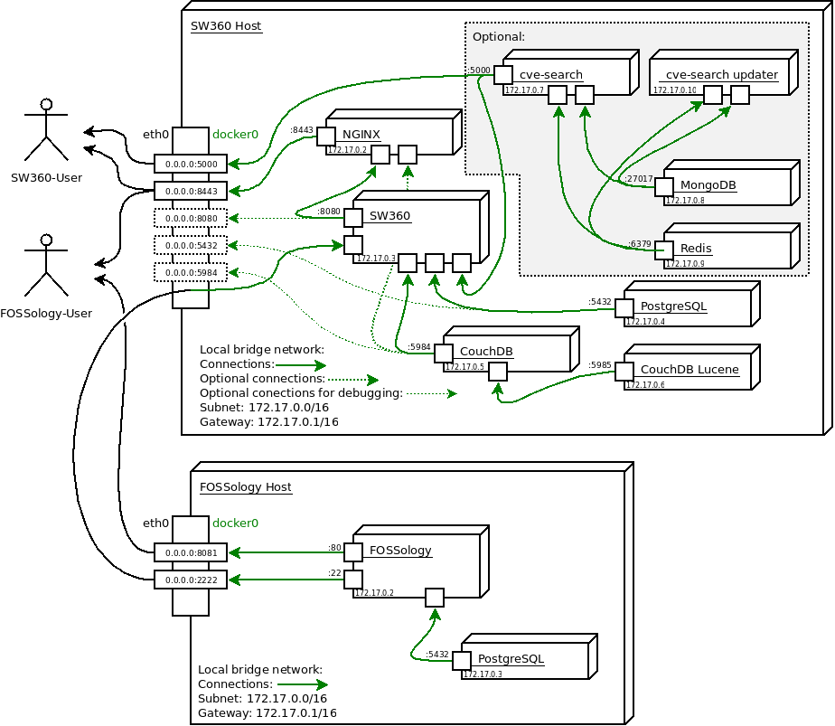

## Prerequisites
You need
- the perl interpreter to run `./sw360chores.pl`
- `git` which is used in some prepare scripts 
- a current version of docker (min 1.10) [https://docs.docker.com/]
- docker-compose (min 1.8) [https://docs.docker.com/compose/install/]
- some disk space at `/var`:
  - **only sw360** needs around 1GB at `/var` and places the content of couchdb in
  the local folder `./_couchdb`
  - **with cve-search** needs around twice as much space at `/var` and places the
  content of the mongodb (currently around 4GB) in a local folder `./_mongodb`
- Internet connection at container build time to download docker images as well
  as Maven dependencies and internet connection at runtime to allow cve-search to
  crawl various external sources for security vulnerability entries.

## Overview
A full setup together with a dockerized FOSSology on another host could look
like this:


# Usage

This project should be controlled via the script `sw360chores.pl`.
## Simple and fast startup
To build all images and start them simply use
```
./sw360chores.pl --build -- up
```

## Configuration

The configuration of passwords, volumes and other things is done in the files
`configuration.yml`, `configuration.env` and `proxy.env`. The environment
variables are not used while building. They are only used by the entrypoint
scripts of the different containers and evaluated when the containers are
actually started.

##### About `configuration.env`
Here you can define passwords for the databases.

##### About `proxy.env`
Here one can add proxy settings, which are passed to all docker-compose calls
and into the containers, which need to connect to the internet.

##### About `configuration.yml`
This file contains configuration, which modifies the behaviour and configuration
of container while running. It is only used while running the containers and
has no implications on the build process.

**Note:** in a company network it might be essential to trust some SSL
certificates. This is done automatically by `./sw360/docker-entrypoint.sh` which
parses the environmental variable `$HTTPS_HOSTS` which could be set in
`configuration.yml`.
This variable has to be a list of `hosts:port` values, i.e. something like
```
      - HTTPS_HOSTS=some.bdp_host.org:443,an.ldaps.host:636
```


## Complete description
To get the complete description of how to use the script use
```
./sw360chores.pl --help
```

#### Logging
For implementing a centralized logging we recomend the
[gliderlabs/logspout](https://github.com/gliderlabs/logspout) container, which
collects and routes the logs of all container in a very configurable way.

Further documentation can be found in the corresponding
[README.md](https://github.com/gliderlabs/logspout/blob/master/README.md).

#### Backup and restore content of docker volumes
The `./sw360chores.pl` command has the optional parameters `--backup` and
`--restore` which allow to write the content of all related volumes to tar
files, which are placed in the folder defined as `BACKUP_FOLDER` in
`./configuration.env`.

## Vagrant for testing / demonstration

One can build the docker setup within a Virtualbox controlled by Vagrant via
```
$ vagrant up && vagrant reload
```
It will then consume the content from `./_deploy`.

The log from docker than can be watched via
```
$ vagrant ssh -c "/sw360chores/sw360chores.pl -- logs -f"
```

More description can be found in the file `./Vagrantfile`.

# About the folder structure
Each subfolder contains its own readme describing explicitly how to use the
corresponding content.

## The folder `docker-images/`
This folder contains the Dockerfiles and scripts to build the images.

## The folder `deployment/`
This folder contains the docker-compose files, which describe how the images
should be configured.

## The folder `miscellaneous/`
This folder contains the important file `test_users_with_passwords_12345.csv`,
which contains example users which can be used in an development or test
setup. All created users have the password `12345`.

Further this contains the following subfolders

- `couchdbPackager/`, which creates a couchDB rpm package for RHEL/CentOS 7
- `cveSearchBox/`, which contains a simple Vagrantfile which starts a standalone
  cve-search server
- `scripts/`, which contain some useful scripts.

None of the things in this folder are directly used by the packaging or
deployment part.

## Folders starting with `_`
All folders starting with `_` are transient.
